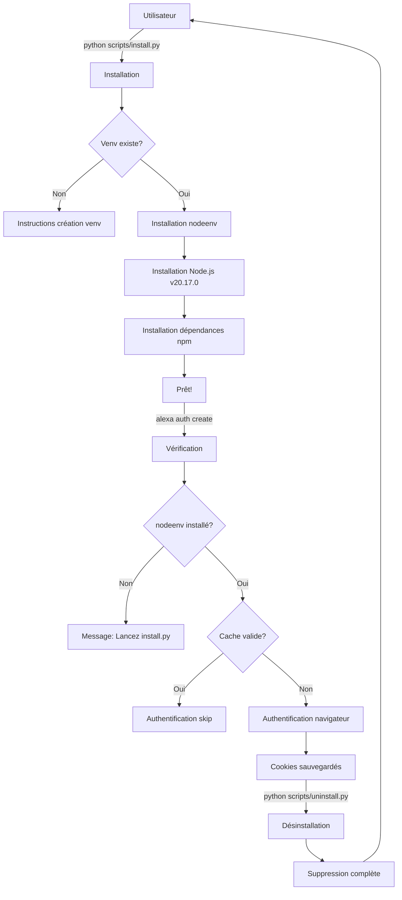

# 📦 Guide d'Installation et Désinstallation

## Architecture du système d'authentification

Le projet utilise **nodeenv** pour un environnement Node.js isolé, garantissant :

- ✅ Pas d'interférence avec Node.js système
- ✅ Installation reproductible
- ✅ Nettoyage complet possible
- ✅ Isolation des dépendances

## 🔧 Structure des fichiers

```
alexa_advanced_control/
├── scripts/
│   ├── install.py          # Installation complète (nodeenv + npm)
│   └── uninstall.py        # Désinstallation complète
├── alexa_auth/
│   ├── nodejs/
│   │   ├── .nodeenv/       # Environnement Node.js isolé (créé par install.py)
│   │   ├── node_modules/   # Dépendances npm (installées par install.py)
│   │   ├── package.json    # Définition des dépendances
│   │   └── *.js            # Scripts d'authentification
│   ├── data/               # Cookies et tokens (créé automatiquement)
│   │   ├── cookie-resultat.json
│   │   └── cookie.txt
│   └── alexa_cookie_retriever.py  # Wrapper Python pour Node.js
├── cli/commands/auth.py    # Commande CLI avec vérification nodeenv
└── requirements.txt        # Inclut nodeenv>=1.8.0
```

## 📋 Processus d'installation complet

### Étape 0 : **Créer le venv Python** (OBLIGATOIRE EN PREMIER)

**Avant toute chose, créez l'environnement virtuel Python :**

#### Windows :

```bash
# Créer le venv
scripts\venv_manager.bat create

# Activer le venv
scripts\venv_manager.bat activate
```

#### Linux/Mac :

```bash
# Créer le venv
bash scripts/venv_manager.sh create

# Activer le venv
source scripts/venv_manager.sh activate
```

### Étape 1 : **install.py** - Installation de Node.js et dépendances

**⚠️ Assurez-vous que le venv est activé avant de lancer cette commande !**

**Ce que fait le script :**

1. ✅ Vérifie le venv Python (doit être activé)
2. ✅ Installe les dépendances Python (incluant `nodeenv`)
3. ✅ Installe Node.js v20.17.0 via nodeenv dans `alexa_auth/nodejs/.nodeenv/`
4. ✅ Installe les dépendances npm (`alexa-cookie2`, `yargs`, etc.)
5. ✅ Configure l'environnement prêt à l'emploi

**Chemins créés :**

- Windows: `alexa_auth/nodejs/.nodeenv/node.exe`
- Linux/Mac: `alexa_auth/nodejs/.nodeenv/bin/node`

**Commande :**

```bash
python scripts/install.py
```

### Étape 2 : **auth create** - Authentification

**Ce que fait la commande :**

1. ✅ Vérifie si `alexa_auth/nodejs/.nodeenv/` existe
2. ✅ Vérifie si `node.exe` / `npm.cmd` existent
3. ❌ Si absent → Affiche les instructions complètes (venv + install.py)
4. ✅ Si présent → Lance l'authentification

**Sécurités intégrées :**

- Détection automatique du cache (24h)
- Pas de ré-authentification si cookie valide
- Messages clairs pour guider l'utilisateur (avec instructions venv si nécessaire)

**Commande :**

```bash
alexa auth create
# ou
alexa auth create --force  # Force une nouvelle auth même si cache valide
```

### Étape 3 : **uninstall.py** - Nettoyage complet

**Ce que fait le script :**

1. ✅ Supprime `venv/` (environnement virtuel Python)
2. ✅ Supprime `alexa_auth/nodejs/.nodeenv/` (Node.js isolé)
3. ✅ Supprime `alexa_auth/nodejs/node_modules/` (dépendances npm)
4. ✅ Supprime `alexa_auth/data/` (cookies et tokens)
5. ✅ Supprime tous les fichiers cache Python (`__pycache__`, `*.pyc`, etc.)
6. ✅ Supprime les fichiers temporaires

**Sécurité :**

- Demande confirmation avant suppression
- Détecte si lancé depuis le venv → Se relance avec Python système
- Affiche la taille des éléments supprimés

**Commande :**

```bash
python scripts/uninstall.py
```

## 🔄 Flux de travail complet



## 📊 Cohérence des chemins

### Fichier: `scripts/install.py`

```python
self.node_env_dir = self.nodejs_dir / ".nodeenv"
self.node_executable = self.node_env_dir / "node.exe"      # Windows
self.node_executable = self.node_env_dir / "bin" / "node"  # Linux/Mac
self.npm_executable = self.node_env_dir / "npm.cmd"        # Windows
self.npm_executable = self.node_env_dir / "bin" / "npm"    # Linux/Mac
```

### Fichier: `alexa_auth/alexa_cookie_retriever.py`

```python
self.node_env_dir = script_dir / "nodejs" / ".nodeenv"
self.node_executable = self.node_env_dir / "node.exe"      # Windows
self.node_executable = self.node_env_dir / "bin" / "node"  # Linux/Mac
self.npm_executable = self.node_env_dir / "npm.cmd"        # Windows
self.npm_executable = self.node_env_dir / "bin" / "npm"    # Linux/Mac
```

### Fichier: `scripts/uninstall.py`

```python
self.node_env_dir = self.nodejs_dir / ".nodeenv"
# Supprime tout le répertoire .nodeenv
```

### Fichier: `cli/commands/auth.py`

```python
script_dir = Path("alexa_auth").absolute()
node_env = NodeEnvironment(script_dir)
if not node_env.is_installed():  # Vérifie .nodeenv/node.exe existe
    # Message vers install.py
```

✅ **Tous les chemins sont cohérents !**

## 🎯 Points clés

1. **Isolation complète** : Node.js est dans `.nodeenv/`, pas dans le système
2. **Pas de conflits** : Chaque projet peut avoir sa propre version de Node.js
3. **Nettoyage facile** : `uninstall.py` supprime tout sans traces
4. **Vérifications automatiques** : `auth create` guide l'utilisateur
5. **Cache intelligent** : Évite les authentifications redondantes (24h)

## 🔍 Dépannage

### Erreur : "Node.js (nodeenv) n'est pas installé"

```bash
python scripts/install.py
```

### Erreur : "Permission refusée" lors de uninstall

```bash
# Sortir du venv d'abord
deactivate
# Puis relancer
python scripts/uninstall.py
```

### Réinstallation propre

```bash
# 1. Tout supprimer
python scripts/uninstall.py

# 2. Réinstaller
python scripts/install.py

# 3. Authentifier
alexa auth create
```

## 📝 Notes de version

- **Node.js** : v20.17.0 (LTS)
- **nodeenv** : >=1.8.0
- **Dépendances npm** : alexa-cookie2, yargs
- **Cache d'authentification** : 24 heures
