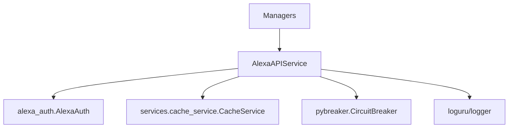

# AlexaAPIService — Design Document

But : centraliser toutes les communications HTTP avec les APIs Alexa dans un service unique.

## Contexte

Le code actuel disperse les appels HTTP dans plusieurs managers et services d'authentification. Cela complique les tests, la maintenance et introduit des duplications (endpoints, gestion d'erreurs, retry).

## Responsabilités

- Fournir un point d'entrée unique pour tous les appels HTTP vers Alexa.
- Déclarer et documenter tous les endpoints (ENDPOINTS dict).
- Gérer les timeouts, retries, et la stratégie de fallback (cache).
- Intégrer un circuit breaker (pybreaker) pour la résilience.
- Fournir un logging structuré avec correlation_id par requête.
- Fournir des méthodes métiers (domain-specific) au lieu d'appels HTTP bruts.

## Décisions d'architecture

- Utiliser injection de dépendances : le service reçoit `AlexaAuth` et `CacheService`.
- Exposer uniquement des méthodes métier (get_devices, send_speak_command, ...).
- Centraliser la configuration (timeouts, seuils CB) via `utils.config.get_config()`.
- Retourner des DTOs (Phase 3) ou dicts en attendant l'intégration.
- Les managers doivent dépendre d'`AlexaAPIService`, pas d'`AlexaAuth` directement.

## Diagramme (Mermaid)



## API publique (exemples)

- get_devices(use_cache_fallback: bool = True) -> List[Dict]
- send_speak_command(device_serial: str, text: str) -> None
- get_music_status(device_id: str) -> Dict
- \_call(method: str, endpoint_key: str, \*\*kwargs) -> Response

Notes :

- `endpoint_key` est une clef dans `ENDPOINTS` (ex: "get_devices").
- `_call` encapsule le circuit breaker, retry et logging.

## ENDPOINTS (exemple)

```python
ENDPOINTS = {
    "get_devices": "/api/devices-v2/device",
    "speak": "/api/speak",
    # ... ajouter après l'audit
}
```

## Error handling

- Utiliser `core.exceptions` pour typer les erreurs : `APIError`, `AuthenticationError`, `RateLimitError`, `CircuitBreakerOpenError`.
- Sur erreur HTTP : wrapper `APIError(status_code=..., message=...)`.
- Si circuit breaker ouvert : lever `CircuitBreakerOpenError`.
- Sur échec, fallback vers `CacheService` si activation `use_cache_fallback`.

## Logging

- Chaque requête génère un `correlation_id` UUID.
- Utiliser `loguru` ou le logger du projet (préférer l'interface projet si existante).
- Logs structurés : level, correlation_id, endpoint, latency, status_code.

## Tests

- TDD : tests d'abord dans `Dev/pytests/services/test_alexa_api_service.py`.
- Mock `AlexaAuth` et `CacheService`.
- Tests à écrire :
  - initialisation
  - get_devices success
  - get_devices fallback
  - circuit breaker behavior
  - error mapping (401, 429)
  - request logging with correlation_id

## Migration

- Remplacer dans les managers `self._auth.get/post` par `self._api_service.method()`.
- Injecter `AlexaAPIService` via `di_container`/constructeurs.
- Migrer managers par lots et exécuter tests après chaque commit.

## Checklist avant merge

- [ ] ENDPOINTS documentés
- [ ] Tests TDD ajoutés
- [ ] Coverage du service >= 90%
- [ ] Aucune occurrence de `self._auth.get/post` dans `core/managers` (sauf tests)
- [ ] Documentation `docs/design_alexa_api_service.md` approuvée

---

Fichier généré automatiquement à partir de `Dev/docs/Refacto_phase1.md`.
